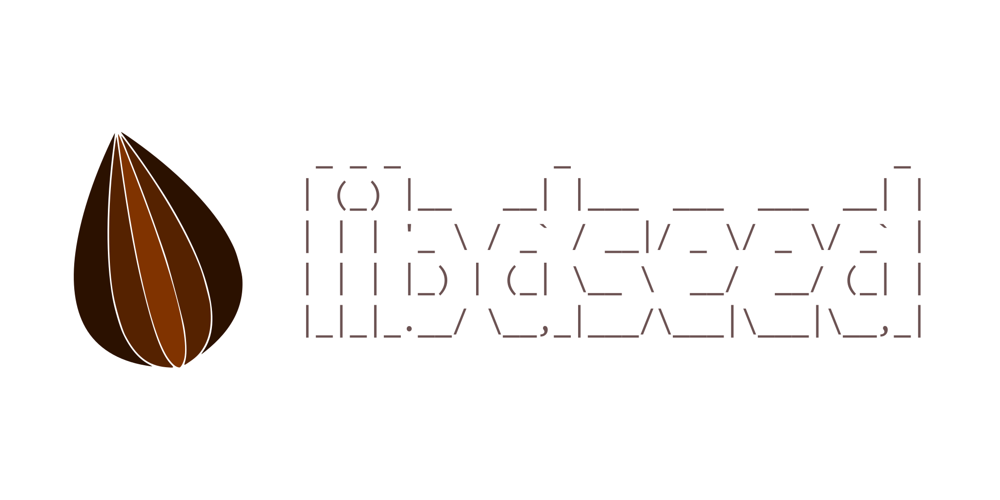

# libdseed
This is base library for personal project.

## Features
* SIMD Vector/Matrix Math Interface
* Reference Counting Object
* Stream/File-System Interface
* 100-nanoseconds based Timespan
* Bitmap Decoders/Encoders
* Bitmap Color-space Conversion
* Bitmap Flip/Crop/Arithmetic-Operation/Resize
* Audio Decoders/Encoders
* Audio PCM Data-type Conversion

## Goals
* Light-weight Cross-platform Game Engine Framework
* SIMD Bitmap/Audio Processing
* AVX2 Math Interface
* Implement Content Pipeline